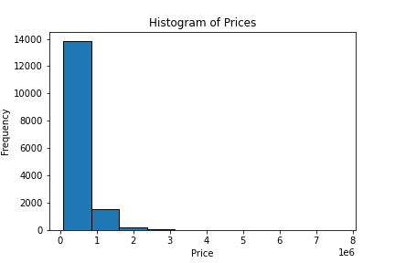
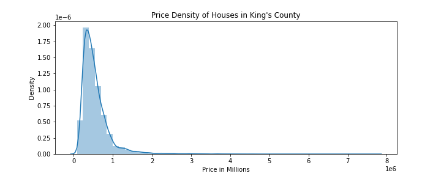
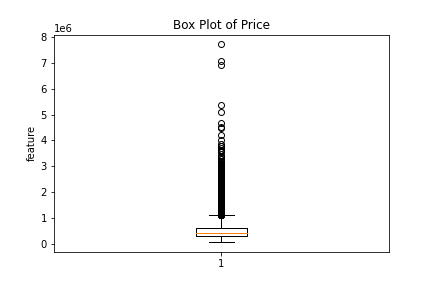
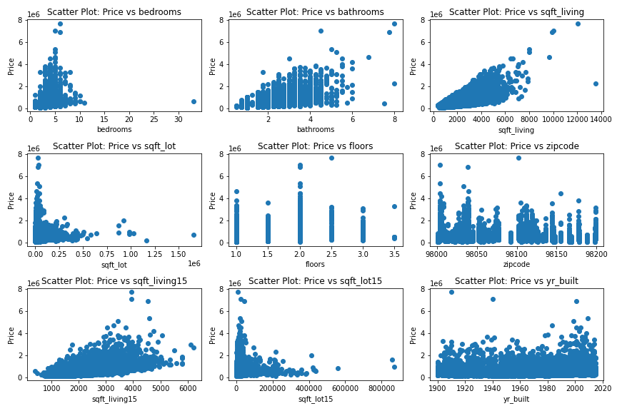
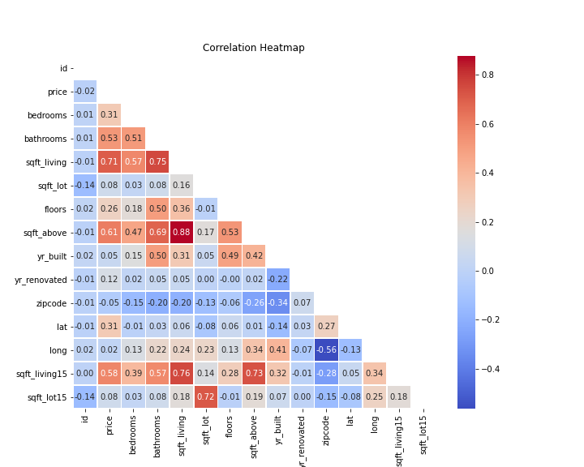

# Predictive analysis of House prices in King County

## Project Overview

This project uses linear regression analysis to infer how certain variables impact housing prices and by how much. The aim is to gain insights and make predictions about the factors that affect house sales in King County area as well as lucrative neighbourhoods to invest in while using statistical techniques to support relevant recommendations.

## Business Problem

The real estate agency wants to provide homeowners with advice on how home renovations can potentially increase the estimated value of their homes and by what amount. The agency aims to offer valuable insights to homeowners, helping them make informed decisions about renovation projects that can maximize their return on investment when selling their properties.

## Business Objectives

The analysis aims to answer below questions in trying to predict the prices;

   1. To determine how much would adding an extension to the lot area of the home likely increase sale price?

   2. To examine how much would adding an additional bathroom likely increase sale price?
    
   3. To determine how much would adding an extension to the living area of the home likely increase sale price?

   4. To examine how much would adding an additional floor to a house likely increase sale price?

## The Data

The dataset used for predicting the sales price of houses in King County is found in kc_house_data.csv. It comprises 21,597 observations and consists of 20 house features along with a column indicating the house price. The data covers homes sold between May 2014 and May 2015. Out of the 20 features, eight are continuous numerical variables that provide information about the area dimensions and geographical location of the house.
These variables offer a general overview of the house's structure and characteristics. The remaining attributes are discrete variables, which offer more detailed information about specific components of the house. The discrete variables include quantifications of various items within the house, such as the number of bedrooms, bathrooms, presence of a waterfront, and floor level. Some attributes also provide background information about the house, such as the year of construction, year of innovation, previous selling price, and date of sale.

More information about the data can be found on"[here](https://github.com/learn-co-curriculum/dsc-phase-2-project-v2-3/blob/main/data/column_names.md)".
 

## Metrics of success

Our metrics of success will be the R-Squared and the Root Mean Square of Errors(RMSE). This will be the final step in evaluating the performance of the model by doing a train-test split, which will give us an idea of how the model would perform with new data for the same variables that the model will be trained on, and another set that it will be tested on. By default, the function takes 80% of the data as the training subset and the other 20% as its test subset.

## Exploratory Data Analysis (EDA)

### Univariate analysis

As we can see from the above two visualizations, the distribution of house prices is right-skewed. This means that there are a large number of houses that are relatively inexpensive, but there are also a small number of houses that are very expensive, denoting presence of outliers.

Based on the box plot there is presence of outliers in the house prices which we decided to keep based on the assumption that they are a true representation of the real-world dataset.

### Bivariate Analysis

Based on the scatter plots above, we can point out that Square foot of living potentially has the highest positive correlation with price; we can therefore assume that as the square foot of living increases, so does price.

Based on the heatmap, we can back up our findings from the scatter plot that indeed Square foot of living has the highest positive correlation with price with a value of 0.71. In second and third places we have Square foot above (Square footage of house apart from basement) with a value of 0.61 and Square foot living15 (The square footage of interior housing living space for the nearest 15 neighbors) with a value of 0.58.

## Conclusion/Findings

1. The model is generally statistically significant with an F-statistic p_value of 0.0 at a significance level of 0.05

2. The R-squared value is 0.833, indicating that approximately 83.3% of the variation in the price can be explained by the model. This value indicates a great improvement from the previous models.

3. Also, of great importance to note is that the mean RMSE is approximately 0.06465. Then the RMSE in original scale is 0.1135. This means that our model is off by about 0.1135 when making an average prediction, indicating that it is a good model.

4. These coefficients represent the expected change in the price for a one-unit change in the corresponding predictor variable, assuming other variables are held constant.

ZIPCODE--is a strong predictor of a homes value, the saying "Location, Location, Location" holds true, as even in a similar area the location plays a huge factor in the value of a home.
Based on the coefficients of different localities, moving from zip code 98002 to 98039 shows that the prices changes by USD 228,087 and USD 298,174 respectively, as compared to our reference categorical variable which is zipcode 98001. This is a clear indication that locality of the house has high influence on the price.

   - Coefficient for `sqft_living` is $123487.74911877913
     For a one-unit increase in square-foot living area, we see an associated increase in around $123487.74 in selling price of the houses.
     
   - Coefficient for `sqft_living15` is $66394.5581188671
     For a one-unit increase in square-foot living area15, we see an associated increase in around $66394.55 in selling price of the houses.
     
   - Coefficient for `floors` is $42072.219101705305
     For a one-unit increase in number of floors of the house, we see an associated increase in around $42072.21 in selling price of the houses.
     
   - Coefficient for `bathrooms` is $46540.35864547536
     For a one-unit increase in the number of bathrooms, we see an associated increase in around $46540.35 in selling price of the houses.
     
   - Coefficient for `sqft_lot` is $20891.42559555274
     For a one-unit increase in square-foot of the lot area, we see an associated increase in around $20891.42 in selling price of the houses.
     
   - Coefficient for `bedrooms` is $-53899.42895874723
     For a one-unit increase in the number of bedrooms, we see an associated decrease in around $53899.42 in selling price of the houses. This particular finding caught our attention as this is not the case in the real world, whereby as you increase the number of bedrooms in a house, the price of the house tends to increase too.
     
5. The plot to test for homoscedasticity reveals that the residuals are now homoscedastic because they are converging and appear to be having an equal variance. So this assumption remains satisfied.

6. The QQ-plot is used to test for normality of residuals. In this case, the residuals appear to be almost normal as they are following along the line almost neatly, except for the ends where it indicates there could be some skewness in the data.

## Recommendations

1. The real estate agency should explore properties that occupy a large square foot of the lot area since, for a one-unit increase in square-foot of the lot area, we see an associated increase in around $ 20891.42 in selling price of the houses.

2. The real estate agency should explore properties that have more bathrooms since, for a one-unit increase in the number of bathrooms, we see an associated increase in around $ 46540.35 in selling price of the houses.

3. The real estate agency should explore properties that occupy a large square foot of living area since, for a one-unit increase in square-foot living area, we see an associated increase in around $ 123487.74 in selling price of the houses.

4. The real estate agency should explore properties with more floors since, for a one-unit increase in number of floors of the house, we see an associated increase in around $ 42072.21 in selling price of the houses.

## Next Steps

1. More research is required to have a more integrated and informative dataset for finding more factors that influence the price. Also, use of more complex and robust regression models that will help to deal with the outliers.

2. Using datasets from other counties to be able to better advice our customers from comparing the dataset results.

3. It is also important for the agency to continuously evaluate the effectiveness of the strategies they implement and make adjustments as necessary. This could involve tracking metrics like, this model, social media engagement/reviews, and lead generation to assess the impact of their efforts and identify areas for improvement.